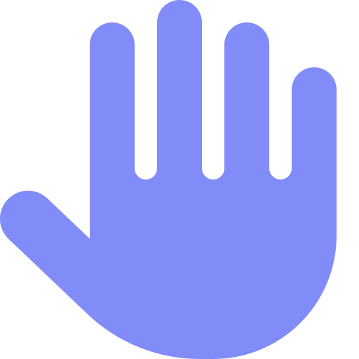
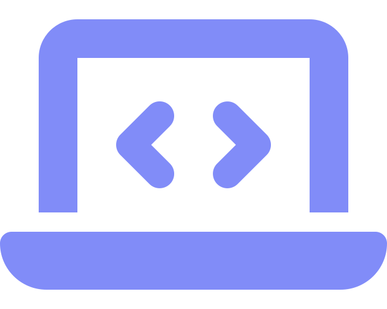
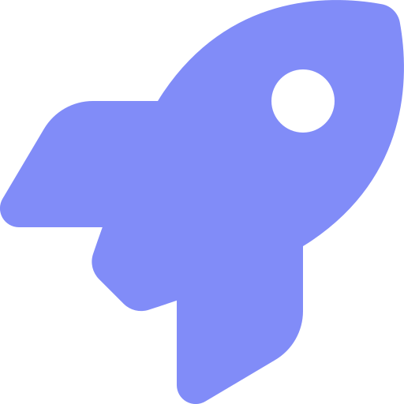
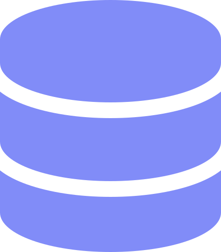
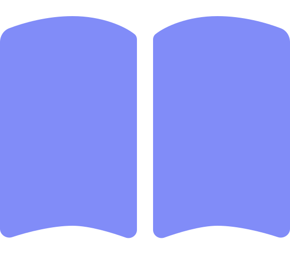
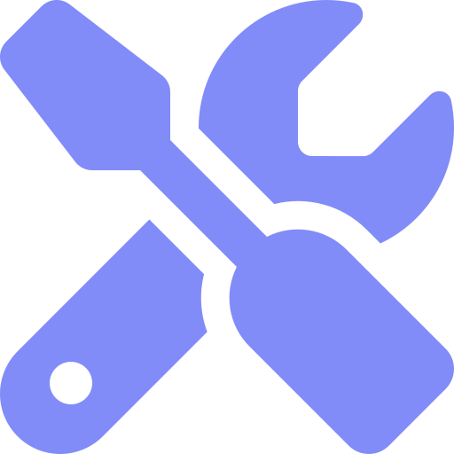
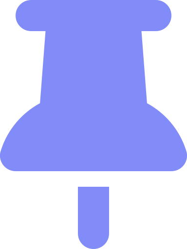
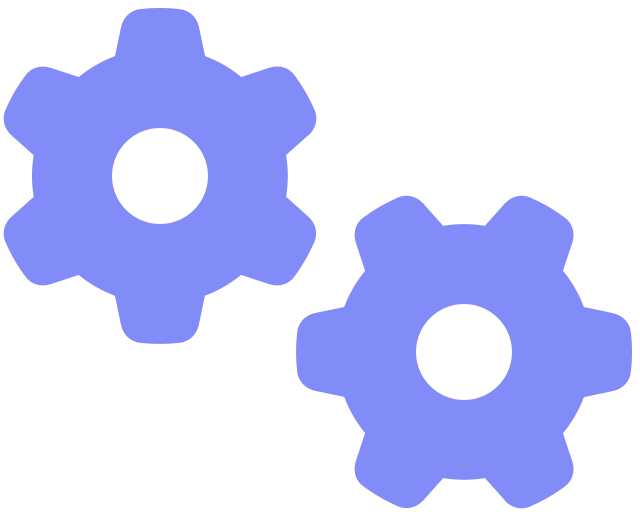
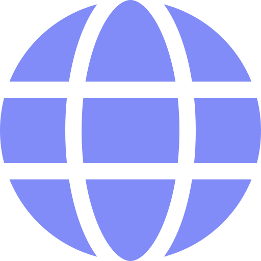
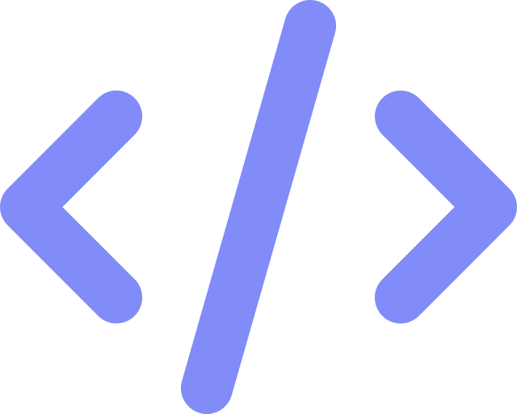

#  Olá, eu sou Anthony Kildery

### Desenvolvedor Web • PHP • Laravel • JavaScript

-  Desenvolvedor Web com foco em **PHP e Front-End**
-  Desenvolvimento de **sistemas internos, dashboards e automações**
-  Experiência com **WordPress, WooCommerce e e-commerce**
-  Trabalho com **MySQL/MariaDB**
-  Cursando **Análise e Desenvolvimento de Sistemas**
-  Atualmente aprofundando conhecimentos em **Laravel, APIs, lógica e arquitetura de software**
-  Estudando também **React e C#/.NET**

---

##  Tecnologias

### Back-End

### Front-End

### Ferramentas

---

##  Atualmente

-  Análise e Desenvolvimento de Sistemas
-  PHP + Laravel
-  MySQL
-  APIs REST e automações
-  Lógica e algoritmos
-  React
-  C# / .NET

---

<picture>
  <source media="(prefers-color-scheme: dark)" srcset="https://raw.githubusercontent.com/anthonyKld/anthonyKld/output/snake-dark.svg">
  <source media="(prefers-color-scheme: light)" srcset="https://raw.githubusercontent.com/anthonyKld/anthonyKld/output/snake.svg">
  
</picture>

